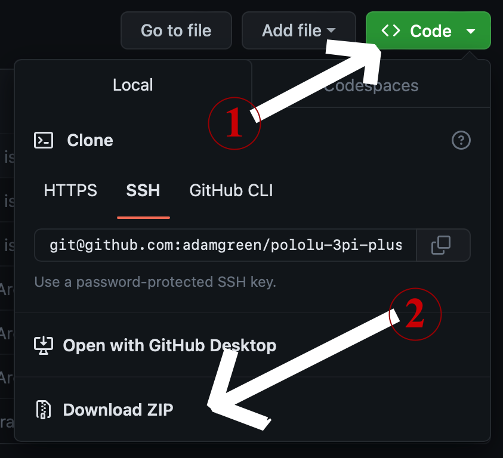

# Pololu3piPlus2040 library

**Note:** *This is not an official library from Pololu. It is a community created port of the [Pololu3piPlus32U4 Library for Arduino](https://github.com/pololu/pololu-3pi-plus-32u4-arduino-library) to the RP2040 version of the same robot kit.*

[www.pololu.com](https://www.pololu.com/category/300/3pi-plus-2040-robot)

## Summary


This is a C++ library for the Arduino IDE that helps access the on-board hardware of the [Pololu 3pi+ 2040 Robot](https://www.pololu.com/category/300/3pi-plus-2040-robot) .

The 3pi+ 2040 robot is a complete, high-performance mobile platform based on the Raspberry Pi RP2040 microcontroller.  It has integrated motor drivers, encoders, a graphical OLED display, a buzzer, buttons, line sensors, front bump sensors, an LSM6DSO accelerometer and gyro, and an LIS3MDL compass. See the [3pi+ 2040 user's guide](https://www.pololu.com/docs/0J86) for more information.

## Installing the library

* You can download this GitHub repository by clicking the `Code` button towards the top of this very page and then selecting the `Download ZIP` option from the resulting drop down.<br><br>
<br><br>
* Once downloaded you can follow the [Importing a .zip Library](https://docs.arduino.cc/software/ide-v1/tutorials/installing-libraries#importing-a-zip-library) steps from the official Arduino documentation.

~~Use the Library Manager in version 1.8.10 or later of the Arduino software (IDE) to install this library:~~

1. ~~In the Arduino IDE, open the "Tools" menu and select "Manage Libraries...".~~
2. ~~Search for "3pi+".~~
3. ~~Click the Pololu3piPlus2040 entry in the list.~~
4. ~~Click "Install".~~
5. ~~If you see a prompt asking to install missing dependencies, click "Install all".~~

## Arduino IDE for the 3pi+ 2040


The latest Arduino IDE already ships with a board package that is compatible with the 3pi+ 2040: **Arduino Mbed OS RP2040 Boards**. The circuit of the 3pi+ 2040 PCB is close enough to the Raspberry Pi Pico that it just works:
* The yellow LED on the 3pi+ 2040 is even connected to the same pin as the user LED on the Pico, **Pin 25**. This means that the stock **Blink** Arduino example just worked on the 3pi+ 2040 as well.
* The Wire library expects the I2C signals to be on the same pins: **Pin 4** (SDA) and **Pin 5** (SCL).


## Uploading from the Arduino IDE to the 3pi+ 2040
The Arduino IDE is able to successfully upload new code to the 3pi+ 2040 over the same USB connection as used for MicroPython programming. There are 2 ways that the Arduino IDE can upload code to the RP2040 microcontroller using the USB cable:
* Once you have Arduino code up and running on your RP2040, the IDE can use USB to make a serial connection to the device. This means that `Serial.print()` calls in your code will show up in Arduino's *Serial Monitor*. Arduino can use this same USB serial connection to place the RP2040 into bootloader mode automatically. The user just needs to select the **Sketch/Upload** option in the Arduino IDE and it will build and deploy the code to your 3pi+ 2040 robot with no manual intervention from you. The image below shows the 3pi+ 2040 robot showing up as a **Rasperry Pi Pico** on the **dev/cu.usbmodem1101** virtual serial port when connected to my Mac.

* The previous automatic upload process doesn't always work though. If the Arduino USB serial driver isn't successfully running on your 3pi+ 2040 then you will need to place the RP2040 into bootloader mode manually before starting the upload process in Arduino.All you need to do is hold down the **B Button** while cycling the **Reset Button**. This will force the RP2040 into bootloader mode where it shows up on your PC as a **RPI-RP2** drive. Once this special drive shows up on your PC, you can just select the **Sketch/Upload** option in the Arduino IDE as usual. When is this slightly more manual process required?
  * If your 3pi+ 2040 robot is currently running MicroPython. The Arduino USB serial driver isn't running on your bot so it can't be used. **Note:** *Switching to Arduino code from MicroPython will delete your custom MicroPython programs from the 3pi+ 2040. Make backup copies of your MicroPython code before uploading Arduino code to the robot.*
  * If your Arduino robot code hangs so bad that the Arduino USB serial driver can't run on the robot.

If you want to switch back to MicroPython after experimenting with Arduino on your 3pi+ 2040 then you can follow the steps in the [Pololu 3pi+2 2040 User's Guide](https://www.pololu.com/docs/0J86/5.1) to reupload the MicroPython firmware.

## Usage

To access most of features of this library, you just need a single include statement.  For convenience, we recommend declaring all of the objects you want to use as global variables, as shown below:

```cpp
#include <Pololu3piPlus2040.h>

OLED display;
Buzzer buzzer;
ButtonA buttonA;
ButtonB buttonB;
ButtonC buttonC;
LineSensors lineSensors;
BumpSensors bumpSensors;
Motors motors;
Encoders encoders;
RGBLEDs leds;
IMU imu;
```

## Examples

Several example sketches are available that show how to use the library.  You can access them from the Arduino IDE by opening the "File" menu, selecting "Examples", and then selecting "Pololu3piPlus2040".  If you cannot find these examples, the library was probably installed incorrectly and you should retry the installation instructions above.

## Classes and functions

The contents of the library are contained in the `Pololu3piPlus2040` namespace. The main classes and functions provided by the library are listed below:

* Pololu3piPlus2040::ButtonA
* Pololu3piPlus2040::ButtonB
* Pololu3piPlus2040::ButtonC
* Pololu3piPlus2040::Buzzer
* Pololu3piPlus2040::Encoders
* Pololu3piPlus2040::OLED
* Pololu3piPlus2040::Motors
* Pololu3piPlus2040::LineSensors
* Pololu3piPlus2040::BumpSensors
* Pololu3piPlus2040::IMU
* Pololu3piPlus2040::RGBLEDs
* Pololu3piPlus2040::ledYellow()
* Pololu3piPlus2040::readBatteryMillivolts()

## Dependencies

This library also references several other Arduino libraries which are used to help implement the classes and functions above.

* [PololuOLED](https://github.com/pololu/pololu-oled-arduino)
* [Pushbutton](https://github.com/pololu/pushbutton-arduino)

## Version history
* 0.1.4 (2024-11-20): Fifth alpha release from community with 1 bug fix:
  * Fixed Issue #1 - Misnamed files
* 0.1.3 (2023-6-18): Fourth alpha release from community with 1 bug fix:
  * Fixed failure to compile Buzzer::playFrequency() reported by gis81576 on Pololu forum.
* 0.1.2 (2023-4-8): Third alpha release from community with a few updates:
  * Moved `Pololu3piPlus2040::BumpSensors::BumpSide` up in namespace to `Pololu3piPlus2040::BumpSide`.
  * Simplify `LineSensors` API to remove `sensorValues` out parameter.
  * Added `RGBLEDs::get()` and `RGBLEDs::getBrightness()` methods to match recent MicroPython library updates.
  * Simplified and fixed a few bugs in my C implementation of the `RGBLEDs::hsv2rgb()` method.
  * Remove buzzer click upon device reset.
  * Fixes to `BumpSensors` class constructor and documentation for `read()` method.
* 0.1.1 (2023-4-4): Second alpha release from community with Motor & Buzzer PWM fixes.
* 0.1.0 (2023-4-4): Initial alpha release from community.
